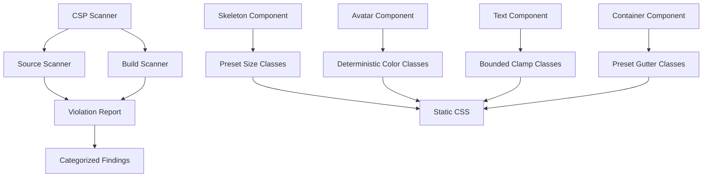

# Design Document

## Overview

This design addresses Milestones 0-1 of the Greater Components strict CSP compatibility initiative. The solution involves two major phases:

1. **Baseline & Inventory (Milestone 0)**: Create scanning tools to identify all CSP violations and establish a policy framework
2. **Core Primitive Refactors (Milestone 1)**: Refactor Skeleton, Avatar, Text, and Container components to eliminate inline styles

The core design principle is to replace dynamic inline styles with class-based presets backed by static CSS. This approach maintains component flexibility while ensuring strict CSP compliance.

## Architecture

### System Components



### Design Patterns

1. **Preset-Based Sizing**: Replace arbitrary numeric values with named presets (xs, sm, md, lg, xl)
2. **Deterministic Color Generation**: Hash-based color class selection for consistent Avatar colors
3. **Bounded Line Clamping**: Fixed set of clamp classes instead of dynamic CSS variables
4. **External CSS Variables**: Custom values require consumer-provided CSS classes

## Components and Interfaces

### CSP Scanner Module

**Purpose**: Identify all inline style and script violations in source code and built output.

**Source Scanner Interface**:
```typescript
interface SourceScanResult {
  file: string;
  line: number;
  column: number;
  type: 'style-attribute' | 'style-binding';
  snippet: string;
  category: 'ship-blocking' | 'follow-up';
  remediation: string;
}

function scanSvelteSource(pattern: string): SourceScanResult[];
```

**Build Scanner Interface**:
```typescript
interface BuildScanResult {
  file: string;
  line: number;
  type: 'inline-style' | 'inline-script';
  snippet: string;
  category: 'ship-blocking' | 'follow-up';
}

function scanBuildOutput(directory: string): BuildScanResult[];
```

**Implementation Approach**:
- Use regex patterns to scan `.svelte` files for `style="..."` and `style={...}`
- Use HTML parser (e.g., `node-html-parser`) to scan built HTML for `style` attributes and inline `<script>` tags
- Categorize findings based on file path (primitives = ship-blocking, others = follow-up)
- Generate actionable reports with file paths, line numbers, and remediation hints

### Skeleton Component Refactor

**Current API** (CSP-unsafe):
```typescript
interface SkeletonProps {
  width?: string | number;  // Arbitrary values → inline style
  height?: string | number; // Arbitrary values → inline style
  variant?: 'text' | 'circular' | 'rectangular' | 'rounded';
  animation?: 'pulse' | 'wave' | 'none';
}
```

**New API** (CSP-safe):
```typescript
type WidthPreset = 'full' | '1/2' | '1/3' | '2/3' | '1/4' | '3/4' | 'content' | 'auto';
type HeightPreset = 'xs' | 'sm' | 'md' | 'lg' | 'xl' | '2xl';

interface SkeletonProps {
  width?: WidthPreset;
  height?: HeightPreset;
  variant?: 'text' | 'circular' | 'rectangular' | 'rounded';
  animation?: 'pulse' | 'wave' | 'none';
  class?: string; // For custom sizing via external CSS
}
```

**CSS Classes**:
```css
/* Width presets */
.gr-skeleton--width-full { width: 100%; }
.gr-skeleton--width-1\/2 { width: 50%; }
.gr-skeleton--width-1\/3 { width: 33.333%; }
.gr-skeleton--width-2\/3 { width: 66.667%; }
.gr-skeleton--width-1\/4 { width: 25%; }
.gr-skeleton--width-3\/4 { width: 75%; }
.gr-skeleton--width-content { width: fit-content; }
.gr-skeleton--width-auto { width: auto; }

/* Height presets */
.gr-skeleton--height-xs { height: 1rem; }
.gr-skeleton--height-sm { height: 1.5rem; }
.gr-skeleton--height-md { height: 2rem; }
.gr-skeleton--height-lg { height: 3rem; }
.gr-skeleton--height-xl { height: 4rem; }
.gr-skeleton--height-2xl { height: 6rem; }

/* Variant defaults */
.gr-skeleton--text { height: 1em; width: 100%; }
.gr-skeleton--circular { width: 40px; height: 40px; border-radius: 50%; }
.gr-skeleton--rectangular { width: 100%; height: 120px; }
.gr-skeleton--rounded { width: 100%; height: 120px; border-radius: 0.5rem; }
```

**Implementation Changes**:
- Remove `skeletonStyle` computed property
- Add width/height preset validation
- Generate class names based on preset values
- Remove style prop merging logic
- Maintain variant-specific default dimensions via CSS

### Avatar Component Refactor

**Current Implementation** (CSP-unsafe):
```svelte
<span style="background-color: {initialsBackgroundColor}; color: white;">
  {initials}
</span>
```

**New Implementation** (CSP-safe):
```svelte
<span class="gr-avatar__initials {colorClass}">
  {initials}
</span>
```

**Color Class Generation**:
```typescript
function generateColorClass(name: string): string {
  let hash = 0;
  for (let i = 0; i < name.length; i++) {
    hash = name.charCodeAt(i) + ((hash << 5) - hash);
  }
  const index = Math.abs(hash) % 12; // 12 color palette
  return `gr-avatar--color-${index}`;
}
```

**CSS Color Palette** (WCAG AA compliant):
```css
.gr-avatar--color-0 { background-color: hsl(0, 65%, 30%); color: white; }
.gr-avatar--color-1 { background-color: hsl(30, 65%, 30%); color: white; }
.gr-avatar--color-2 { background-color: hsl(60, 65%, 30%); color: white; }
.gr-avatar--color-3 { background-color: hsl(90, 65%, 30%); color: white; }
.gr-avatar--color-4 { background-color: hsl(120, 65%, 30%); color: white; }
.gr-avatar--color-5 { background-color: hsl(150, 65%, 30%); color: white; }
.gr-avatar--color-6 { background-color: hsl(180, 65%, 30%); color: white; }
.gr-avatar--color-7 { background-color: hsl(210, 65%, 30%); color: white; }
.gr-avatar--color-8 { background-color: hsl(240, 65%, 30%); color: white; }
.gr-avatar--color-9 { background-color: hsl(270, 65%, 30%); color: white; }
.gr-avatar--color-10 { background-color: hsl(300, 65%, 30%); color: white; }
.gr-avatar--color-11 { background-color: hsl(330, 65%, 30%); color: white; }
```

**Image Display Control**:
- Replace `style="display: {imageLoaded ? 'block' : 'none'}"` with class toggle:
```svelte

```

```css
.gr-avatar__image { display: none; }
.gr-avatar__image--loaded { display: block; }
```

### Text Component Refactor

**Current Implementation** (CSP-unsafe):
```svelte
<p style="--gr-text-clamp-lines: {lines};">
  Content
</p>
```

**New Implementation** (CSP-safe):
```svelte
<p class="gr-text {clampClass}">
  Content
</p>
```

**Clamp Class Generation**:
```typescript
function getClampClass(lines?: number): string {
  if (!lines) return '';
  if (lines >= 2 && lines <= 6) {
    return `gr-text--clamp-${lines}`;
  }
  // Out of range values require external CSS
  return '';
}
```

**CSS Classes**:
```css
.gr-text--truncate {
  overflow: hidden;
  text-overflow: ellipsis;
  white-space: nowrap;
}

.gr-text--clamp {
  display: -webkit-box;
  -webkit-box-orient: vertical;
  overflow: hidden;
}

.gr-text--clamp-2 { -webkit-line-clamp: 2; }
.gr-text--clamp-3 { -webkit-line-clamp: 3; }
.gr-text--clamp-4 { -webkit-line-clamp: 4; }
.gr-text--clamp-5 { -webkit-line-clamp: 5; }
.gr-text--clamp-6 { -webkit-line-clamp: 6; }
```

### Container Component Refactor

**Current Implementation** (CSP-unsafe):
```svelte
<div style="--gr-container-custom-gutter: {gutter};">
  Content
</div>
```

**New API** (CSP-safe):
```typescript
type GutterPreset = 'none' | 'sm' | 'md' | 'lg' | 'xl';

interface ContainerProps {
  gutter?: GutterPreset; // Only presets, no custom values
  maxWidth?: 'sm' | 'md' | 'lg' | 'xl' | '2xl' | 'full';
  centered?: boolean;
  class?: string; // For custom gutters via external CSS
}
```

**Implementation Changes**:
- Remove `customGutterStyle` computed property
- Remove support for numeric/string gutter values
- Only emit preset gutter classes
- Document external CSS pattern for custom gutters

**CSS Classes**:
```css
.gr-container--padded-sm { padding-left: 0.75rem; padding-right: 0.75rem; }
.gr-container--padded-md { padding-left: 1rem; padding-right: 1rem; }
.gr-container--padded-lg { padding-left: 1.5rem; padding-right: 1.5rem; }
.gr-container--padded-xl { padding-left: 2rem; padding-right: 2rem; }
```

## Data Models

### Violation Report Model

```typescript
interface ViolationReport {
  timestamp: string;
  summary: {
    totalViolations: number;
    shipBlocking: number;
    followUp: number;
  };
  sourceViolations: SourceScanResult[];
  buildViolations: BuildScanResult[];
  shipBlockingComponents: string[];
}
```

### Component Preset Configuration

```typescript
interface PresetConfig {
  skeleton: {
    widths: WidthPreset[];
    heights: HeightPreset[];
  };
  avatar: {
    colorCount: number;
    colorHue: number[];
  };
  text: {
    clampRange: [number, number]; // [min, max]
  };
  container: {
    gutters: GutterPreset[];
  };
}
```

## Correctness Properties

*A property is a characteristic or behavior that should hold true across all valid executions of a system—essentially, a formal statement about what the system should do. Properties serve as the bridge between human-readable specifications and machine-verifiable correctness guarantees.*

### Scanner Properties

Property 1: Source scanner detects style attributes
*For any* Svelte file containing `style="..."`, the source scanner should identify it and include it in the violation report with correct file path and line number
**Validates: Requirements 2.1**

Property 2: Source scanner detects style bindings
*For any* Svelte file containing `style={...}`, the source scanner should identify it and include it in the violation report with correct file path and line number
**Validates: Requirements 2.2**

Property 3: Build scanner detects inline styles
*For any* HTML file containing `style="..."` attributes, the build scanner should identify all occurrences and include them in the violation report
**Validates: Requirements 2.3**

Property 4: Build scanner detects inline scripts
*For any* HTML file containing inline `<script>` tags (without `src` attribute), the build scanner should identify all occurrences and include them in the violation report
**Validates: Requirements 2.4**

Property 5: Scanner categorizes findings correctly
*For any* violation found in `packages/primitives/src/components/`, the scanner should categorize it as "ship-blocking"
**Validates: Requirements 2.5**

Property 6: Scanner produces complete reports
*For any* scan execution, the violation report should include file paths, line numbers, violation type, and snippet for each finding
**Validates: Requirements 2.6**

### Skeleton Component Properties

Property 7: Skeleton default usage emits no style attribute
*For any* Skeleton component rendered with default props (no width/height specified), the rendered DOM should contain no `style` attribute
**Validates: Requirements 3.1**

Property 8: Skeleton preset widths emit no style attribute
*For any* valid width preset value (full, 1/2, 1/3, 2/3, 1/4, 3/4, content, auto), rendering Skeleton with that width should emit no `style` attribute
**Validates: Requirements 3.2, 3.4**

Property 9: Skeleton preset heights emit no style attribute
*For any* valid height preset value (xs, sm, md, lg, xl, 2xl), rendering Skeleton with that height should emit no `style` attribute
**Validates: Requirements 3.3, 3.5**

Property 10: Skeleton ignores style prop
*For any* Skeleton component rendered with a `style` prop, the rendered DOM should contain no `style` attribute
**Validates: Requirements 3.7**

Property 11: Skeleton universal CSP compliance
*For any* combination of valid Skeleton props (variant, width, height, animation, loading), the rendered DOM should contain no `style` attribute
**Validates: Requirements 7.1**

### Avatar Component Properties

Property 12: Avatar image display emits no style attribute
*For any* Avatar component with a valid image src, the rendered DOM should contain no `style` attribute for display control
**Validates: Requirements 4.1**

Property 13: Avatar initials emit no style attribute
*For any* Avatar component displaying initials (no src or src failed), the rendered DOM should contain no `style` attribute for background color
**Validates: Requirements 4.2**

Property 14: Avatar uses class-based display control
*For any* Avatar component, image visibility should be controlled via CSS classes (gr-avatar__image--loaded) or the `hidden` attribute, not inline styles
**Validates: Requirements 4.3**

Property 15: Avatar color class determinism
*For any* name or label string, generating the color class twice should produce the same result
**Validates: Requirements 4.4, 4.9**

Property 16: Avatar color class format
*For any* name or label string, the generated color class should match the pattern `gr-avatar--color-N` where N is between 0 and 11
**Validates: Requirements 4.5**

Property 17: Avatar fallback behavior preserved
*For any* Avatar component without a valid image, the component should render one of: initials, label, icon, or default image based on fallbackMode
**Validates: Requirements 4.7**

Property 18: Avatar accessibility preserved
*For any* Avatar component, the rendered element should have an accessible name from alt, name, label, or default "Avatar"
**Validates: Requirements 4.8**

Property 19: Avatar universal CSP compliance
*For any* combination of valid Avatar props (src, name, label, fallbackMode, size, shape, status), the rendered DOM should contain no `style` attribute
**Validates: Requirements 7.2**

### Text Component Properties

Property 20: Text truncate emits no style attribute
*For any* Text component with truncate=true and a supported lines value (2-6), the rendered DOM should contain no `style` attribute
**Validates: Requirements 5.1**

Property 21: Text clamp class generation
*For any* supported lines value (2, 3, 4, 5, 6), the Text component should emit the corresponding class `gr-text--clamp-N`
**Validates: Requirements 5.3**

Property 22: Text removes CSS variable injection
*For any* Text component with truncate and lines props, the rendered DOM should not contain `--gr-text-clamp-lines` in any style attribute
**Validates: Requirements 5.5**

Property 23: Text universal CSP compliance
*For any* combination of valid Text props (as, size, weight, color, align, truncate, lines), the rendered DOM should contain no `style` attribute
**Validates: Requirements 7.3**

### Container Component Properties

Property 24: Container preset gutters emit no style attribute
*For any* valid gutter preset value (none, sm, md, lg, xl), rendering Container with that gutter should emit no `style` attribute
**Validates: Requirements 6.1, 6.3**

Property 25: Container custom gutter emits no style attribute
*For any* Container component with a non-preset gutter value, the rendered DOM should contain no `style` attribute
**Validates: Requirements 6.5**

Property 26: Container preset-only API
*For any* Container component, only preset gutter values (none, sm, md, lg, xl) should be accepted as valid gutter prop values
**Validates: Requirements 6.7**

Property 27: Container universal CSP compliance
*For any* combination of valid Container props (maxWidth, size, gutter, centered), the rendered DOM should contain no `style` attribute
**Validates: Requirements 7.4**

## Error Handling

### Scanner Error Handling

- **File Not Found**: Skip missing files and log warning, continue scanning
- **Parse Errors**: Log parse errors with file path, continue scanning other files
- **Invalid Patterns**: Validate regex patterns before scanning, fail fast on invalid patterns
- **Empty Results**: Return empty array with success status, not an error

### Component Error Handling

- **Invalid Preset Values**: Fall back to default preset, log warning in development
- **Missing Required Props**: Use sensible defaults (e.g., size="md", variant="text")
- **Prop Type Mismatches**: TypeScript types prevent most issues at compile time
- **CSS Class Conflicts**: Use BEM naming to avoid conflicts, document class naming conventions

## Testing Strategy

### Dual Testing Approach

This feature requires both unit tests and property-based tests:

- **Unit tests**: Verify specific examples, edge cases, and error conditions
- **Property tests**: Verify universal properties across all inputs
- Together they provide comprehensive coverage

### Unit Testing

**Scanner Unit Tests**:
- Test scanner with fixture files containing known violations
- Test categorization logic with different file paths
- Test report generation with various violation counts
- Test edge cases: empty files, malformed HTML, missing files

**Component Unit Tests**:
- Test each preset value renders correct class
- Test default behavior (no props)
- Test fallback behavior (Avatar, Skeleton)
- Test accessibility attributes preserved
- Test interactive vs non-interactive rendering

### Property-Based Testing

**Testing Library**: Use `fast-check` for TypeScript/JavaScript property-based testing

**Configuration**: Each property test should run minimum 100 iterations

**Scanner Property Tests**:
```typescript
// Property 1: Source scanner detects style attributes
// Feature: csp-baseline-and-primitives, Property 1
fc.assert(
  fc.property(
    fc.string(), // random file content with style attributes
    (content) => {
      const violations = scanSvelteSource(content);
      const styleCount = (content.match(/style="/g) || []).length;
      return violations.filter(v => v.type === 'style-attribute').length === styleCount;
    }
  ),
  { numRuns: 100 }
);
```

**Component Property Tests**:
```typescript
// Property 11: Skeleton universal CSP compliance
// Feature: csp-baseline-and-primitives, Property 11
fc.assert(
  fc.property(
    fc.record({
      variant: fc.constantFrom('text', 'circular', 'rectangular', 'rounded'),
      width: fc.option(fc.constantFrom('full', '1/2', '1/3', '2/3', '1/4', '3/4', 'content', 'auto')),
      height: fc.option(fc.constantFrom('xs', 'sm', 'md', 'lg', 'xl', '2xl')),
      animation: fc.constantFrom('pulse', 'wave', 'none'),
      loading: fc.boolean()
    }),
    (props) => {
      const { container } = render(Skeleton, { props });
      const element = container.querySelector('.gr-skeleton');
      return element && !element.hasAttribute('style');
    }
  ),
  { numRuns: 100 }
);

// Property 15: Avatar color class determinism
// Feature: csp-baseline-and-primitives, Property 15
fc.assert(
  fc.property(
    fc.string({ minLength: 1 }),
    (name) => {
      const class1 = generateColorClass(name);
      const class2 = generateColorClass(name);
      return class1 === class2;
    }
  ),
  { numRuns: 100 }
);

// Property 23: Text universal CSP compliance
// Feature: csp-baseline-and-primitives, Property 23
fc.assert(
  fc.property(
    fc.record({
      as: fc.constantFrom('p', 'span', 'div', 'label'),
      size: fc.constantFrom('xs', 'sm', 'base', 'lg', 'xl', '2xl'),
      weight: fc.constantFrom('normal', 'medium', 'semibold', 'bold'),
      color: fc.constantFrom('primary', 'secondary', 'tertiary', 'success', 'warning', 'error'),
      align: fc.constantFrom('left', 'center', 'right', 'justify'),
      truncate: fc.boolean(),
      lines: fc.option(fc.integer({ min: 2, max: 6 }))
    }),
    (props) => {
      const { container } = render(Text, { props });
      const element = container.querySelector('.gr-text');
      return element && !element.hasAttribute('style');
    }
  ),
  { numRuns: 100 }
);

// Property 27: Container universal CSP compliance
// Feature: csp-baseline-and-primitives, Property 27
fc.assert(
  fc.property(
    fc.record({
      maxWidth: fc.constantFrom('sm', 'md', 'lg', 'xl', '2xl', 'full'),
      gutter: fc.option(fc.constantFrom('none', 'sm', 'md', 'lg', 'xl')),
      centered: fc.boolean()
    }),
    (props) => {
      const { container } = render(Container, { props });
      const element = container.querySelector('.gr-container');
      return element && !element.hasAttribute('style');
    }
  ),
  { numRuns: 100 }
);
```

### Integration Testing

- Test scanner against actual codebase (packages/primitives)
- Test refactored components in docs/playground builds
- Verify no CSP violations in built output
- Test components with various prop combinations in real usage scenarios

### Visual Regression Testing

- Capture screenshots of components before/after refactor
- Compare visual output to ensure acceptable deltas
- Test all variants and preset combinations
- Use existing Playwright visual testing infrastructure

### Accessibility Testing

- Run axe-core on refactored components
- Verify ARIA attributes preserved
- Test keyboard navigation
- Verify screen reader announcements
- Use existing Playwright a11y testing infrastructure
