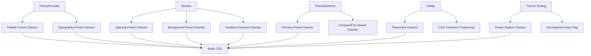

# Design Document

## Overview

This design addresses Milestone 2 of the Greater Components strict CSP compatibility initiative. The solution involves refactoring theme and layout primitives to eliminate inline styles through:

1. **ThemeProvider**: Replace runtime CSS variable injection with class-based palette/typography presets
2. **Section**: Restrict spacing/background to preset values with class-based application
3. **ThemeSwitcher**: Remove dynamic color preview styling, use preset classes
4. **Tooltip**: Replace pixel-based positioning with CSS-based placement classes
5. **Theme Tooling**: Redesign or deprecate components requiring dynamic color swatches

The core design principle remains consistent with Milestone 1: replace dynamic inline styles with class-based presets backed by static CSS.

## Architecture

### System Components



### Design Patterns

1. **Preset-Based Theming**: Replace arbitrary palette/font values with named presets
2. **CSS-Only Positioning**: Use CSS transforms and relative positioning instead of JS-calculated pixels
3. **Class-Based State**: Use CSS classes for all visual states (placement, colors, spacing)
4. **Development-Only Components**: Mark theme tooling as dev-only if dynamic colors are essential

## Components and Interfaces

### ThemeProvider Component Refactor

**Current API** (CSP-unsafe):
```typescript
interface ThemeProviderProps {
  theme?: ColorScheme;
  palette?: PalettePreset;
  customPalette?: CustomPalette;  // Inline CSS variable injection
  headingFont?: string;           // Arbitrary font string
  bodyFont?: string;              // Arbitrary font string
  children: Snippet;
}
```

**New API** (CSP-safe):
```typescript
type PalettePreset = 'slate' | 'stone' | 'neutral' | 'zinc' | 'gray';
type FontPreset = 'system' | 'sans' | 'serif' | 'mono';

interface ThemeProviderProps {
  theme?: ColorScheme;
  palette?: PalettePreset;
  headingFontPreset?: FontPreset;
  bodyFontPreset?: FontPreset;
  class?: string;  // For custom theming via external CSS
  children: Snippet;
}
```

**Implementation Changes**:
- Remove `customCSS` derived property
- Remove `style={customCSS}` from template
- Generate class names based on preset values
- Apply palette via `gr-theme-provider--palette-{preset}` class
- Apply fonts via `gr-theme-provider--heading-{preset}` and `gr-theme-provider--body-{preset}` classes

**CSS Classes**:
```css
/* Palette presets */
.gr-theme-provider--palette-slate {
  --gr-color-gray-50: #f8fafc;
  --gr-color-gray-100: #f1f5f9;
  /* ... full scale */
}
.gr-theme-provider--palette-stone { /* ... */ }
.gr-theme-provider--palette-neutral { /* ... */ }
.gr-theme-provider--palette-zinc { /* ... */ }
.gr-theme-provider--palette-gray { /* ... */ }

/* Typography presets */
.gr-theme-provider--heading-system {
  --gr-typography-fontFamily-heading: system-ui, sans-serif;
}
.gr-theme-provider--heading-sans {
  --gr-typography-fontFamily-heading: 'Inter', sans-serif;
}
.gr-theme-provider--heading-serif {
  --gr-typography-fontFamily-heading: 'Crimson Pro', serif;
}
.gr-theme-provider--heading-mono {
  --gr-typography-fontFamily-heading: 'JetBrains Mono', monospace;
}

.gr-theme-provider--body-system {
  --gr-typography-fontFamily-sans: system-ui, sans-serif;
}
.gr-theme-provider--body-sans {
  --gr-typography-fontFamily-sans: 'Inter', sans-serif;
}
.gr-theme-provider--body-serif {
  --gr-typography-fontFamily-sans: 'Crimson Pro', serif;
}
.gr-theme-provider--body-mono {
  --gr-typography-fontFamily-sans: 'JetBrains Mono', monospace;
}
```

### Section Component Refactor

**Current API** (CSP-unsafe):
```typescript
interface SectionProps {
  spacing?: SpacingPreset | string | number;  // Arbitrary values
  background?: BackgroundVariant | string;     // Arbitrary CSS values
  // ...
}
```

**New API** (CSP-safe):
```typescript
type SpacingPreset = 'none' | 'sm' | 'md' | 'lg' | 'xl' | '2xl' | '3xl' | '4xl';
type BackgroundPreset = 'default' | 'muted' | 'accent' | 'gradient';
type GradientDirection = 'to-top' | 'to-bottom' | 'to-left' | 'to-right' |
                         'to-top-left' | 'to-top-right' | 'to-bottom-left' | 'to-bottom-right';

interface SectionProps {
  spacing?: SpacingPreset;
  background?: BackgroundPreset;
  gradientDirection?: GradientDirection;
  padding?: boolean | 'sm' | 'md' | 'lg';
  centered?: boolean;
  class?: string;  // For custom styling via external CSS
  children?: Snippet;
}
```

**Implementation Changes**:
- Remove `customSpacingStyle` and `customBackgroundStyle` computed properties
- Remove `style={customStyle}` from template
- Remove `isSpacingPreset` and `isBackgroundPreset` checks (all values are presets)
- Remove `gr-section--spacing-custom` and `gr-section--bg-custom` classes
- Simplify class generation to only use preset classes

**CSS Classes**:
```css
/* Spacing presets */
.gr-section--spacing-none { margin-top: 0; margin-bottom: 0; }
.gr-section--spacing-sm { margin-top: 2rem; margin-bottom: 2rem; }
.gr-section--spacing-md { margin-top: 4rem; margin-bottom: 4rem; }
.gr-section--spacing-lg { margin-top: 6rem; margin-bottom: 6rem; }
.gr-section--spacing-xl { margin-top: 8rem; margin-bottom: 8rem; }
.gr-section--spacing-2xl { margin-top: 10rem; margin-bottom: 10rem; }
.gr-section--spacing-3xl { margin-top: 12rem; margin-bottom: 12rem; }
.gr-section--spacing-4xl { margin-top: 16rem; margin-bottom: 16rem; }

/* Background presets */
.gr-section--bg-muted { background-color: var(--gr-color-surface-muted); }
.gr-section--bg-accent { background-color: var(--gr-color-primary-50); }
.gr-section--bg-gradient {
  background: linear-gradient(var(--gr-section-gradient-direction, to bottom),
    var(--gr-color-surface), var(--gr-color-surface-muted));
}

/* Gradient directions */
.gr-section--gradient-to-top { --gr-section-gradient-direction: to top; }
.gr-section--gradient-to-bottom { --gr-section-gradient-direction: to bottom; }
.gr-section--gradient-to-left { --gr-section-gradient-direction: to left; }
.gr-section--gradient-to-right { --gr-section-gradient-direction: to right; }
.gr-section--gradient-to-top-left { --gr-section-gradient-direction: to top left; }
.gr-section--gradient-to-top-right { --gr-section-gradient-direction: to top right; }
.gr-section--gradient-to-bottom-left { --gr-section-gradient-direction: to bottom left; }
.gr-section--gradient-to-bottom-right { --gr-section-gradient-direction: to bottom right; }
```

### ThemeSwitcher Component Refactor

**Current Implementation** (CSP-unsafe):
```svelte
<button
  style={`background-color: ${primaryColor}; color: ${previewButtonTextColor()}`}
>
  Primary
</button>
```

**New Implementation** (CSP-safe):
```svelte
<button class="gr-theme-switcher__preview-button gr-theme-switcher__preview-button--primary">
  Primary
</button>
```

**Implementation Changes**:
- Remove `primaryColor`, `secondaryColor`, `accentColor` state variables
- Remove `previewButtonTextColor` derived function
- Remove inline `style={...}` from preview buttons
- Remove `showAdvanced` custom colors feature (or redesign to use presets)
- Remove `showWorkbench` feature (or mark as dev-only)
- Use CSS custom properties from ThemeProvider for preview colors

**CSS Classes**:
```css
.gr-theme-switcher__preview-button--primary {
  background-color: var(--gr-color-primary);
  color: var(--gr-color-primary-foreground);
}

.gr-theme-switcher__preview-button--secondary {
  background-color: var(--gr-color-secondary);
  color: var(--gr-color-secondary-foreground);
}
```

**Feature Decisions**:
- `showAdvanced`: Remove custom color pickers; users can customize via external CSS
- `showWorkbench`: Remove or mark as development-only tool not shipped to production

### Tooltip Component Refactor

**Current Implementation** (CSP-unsafe):
```svelte
<div
  style="position: absolute; top: {tooltipPosition.top}px; left: {tooltipPosition.left}px; z-index: 9999;"
>
```

**New Implementation** (CSP-safe):
```svelte
<div class="gr-tooltip gr-tooltip--{actualPlacement} gr-tooltip--visible">
```

**Positioning Strategy**:

The tooltip will use CSS-based positioning relative to its trigger element:

1. **Container Setup**: Tooltip container uses `position: relative`
2. **Tooltip Positioning**: Tooltip uses `position: absolute` with CSS transforms
3. **Placement Classes**: Each placement (top/bottom/left/right) has specific CSS rules
4. **Auto Placement**: JS determines best placement, applies corresponding class

**CSS Classes**:
```css
.gr-tooltip-container {
  position: relative;
  display: inline-block;
}

.gr-tooltip {
  position: absolute;
  z-index: 9999;
  opacity: 0;
  pointer-events: none;
  transition: opacity 0.15s ease-in-out;
}

.gr-tooltip--visible {
  opacity: 1;
  pointer-events: auto;
}

/* Placement classes */
.gr-tooltip--top {
  bottom: 100%;
  left: 50%;
  transform: translateX(-50%);
  margin-bottom: 8px;
}

.gr-tooltip--bottom {
  top: 100%;
  left: 50%;
  transform: translateX(-50%);
  margin-top: 8px;
}

.gr-tooltip--left {
  right: 100%;
  top: 50%;
  transform: translateY(-50%);
  margin-right: 8px;
}

.gr-tooltip--right {
  left: 100%;
  top: 50%;
  transform: translateY(-50%);
  margin-left: 8px;
}

/* Arrow positioning */
.gr-tooltip--top .gr-tooltip__arrow {
  bottom: -4px;
  left: 50%;
  transform: translateX(-50%) rotate(45deg);
}

.gr-tooltip--bottom .gr-tooltip__arrow {
  top: -4px;
  left: 50%;
  transform: translateX(-50%) rotate(45deg);
}

.gr-tooltip--left .gr-tooltip__arrow {
  right: -4px;
  top: 50%;
  transform: translateY(-50%) rotate(45deg);
}

.gr-tooltip--right .gr-tooltip__arrow {
  left: -4px;
  top: 50%;
  transform: translateY(-50%) rotate(45deg);
}
```

**Auto Placement Logic**:
```typescript
function calculatePlacement(): Placement {
  if (placement !== 'auto') return placement;
  
  const triggerRect = triggerElement.getBoundingClientRect();
  const viewportHeight = window.innerHeight;
  const viewportWidth = window.innerWidth;
  
  // Simple heuristic: prefer top, fall back based on available space
  const spaceAbove = triggerRect.top;
  const spaceBelow = viewportHeight - triggerRect.bottom;
  const spaceLeft = triggerRect.left;
  const spaceRight = viewportWidth - triggerRect.right;
  
  if (spaceAbove >= 100) return 'top';
  if (spaceBelow >= 100) return 'bottom';
  if (spaceRight >= 150) return 'right';
  if (spaceLeft >= 150) return 'left';
  return 'top'; // Default fallback
}
```

**Constraints vs Current Implementation**:
- Tooltips are positioned relative to trigger, not viewport
- No pixel-perfect positioning across the entire page
- Tooltips may clip at viewport edges (acceptable trade-off for CSP compliance)
- Document that pixel-perfect positioning requires external CSS

### Theme Tooling Components Refactor

**Decision**: Mark theme tooling components as **development-only tools** that are not shipped to production Lesser deployments.

**Rationale**:
- ThemeWorkbench, ColorHarmonyPicker, and ContrastChecker require dynamic color visualization
- Making them fully CSP-compatible would significantly reduce their utility
- These are design-time tools, not runtime components

**Implementation Options**:

**Option A: Remove from shipped bundle** (Recommended)
- Move to a separate `@equaltoai/greater-components-dev-tools` package
- Not included in production builds
- Document as development-only

**Option B: Preset-based redesign**
- Replace dynamic swatches with preset color classes
- Limited to showing predefined palette colors
- Reduced functionality but CSP-compatible

**Option C: Keep with CSP warning**
- Keep current implementation
- Add prominent warning in docs
- Exclude from CSP audit for shipped components

**Recommended Approach**: Option A - separate dev-tools package

If Option B is chosen, the implementation would be:

**ThemeWorkbench CSS Classes**:
```css
/* Preset swatch colors (primary scale) */
.gr-swatch--primary-50 { background-color: var(--gr-color-primary-50); }
.gr-swatch--primary-100 { background-color: var(--gr-color-primary-100); }
.gr-swatch--primary-200 { background-color: var(--gr-color-primary-200); }
/* ... through 900 */

/* Harmony swatches use CSS custom properties set by parent */
.gr-harmony-swatch {
  background-color: var(--gr-harmony-color);
}
```

**ColorHarmonyPicker Redesign**:
- Show harmony colors using CSS custom properties
- Parent component sets `--gr-harmony-color-N` via classes
- Limited to preset harmony palettes

**ContrastChecker Redesign**:
- Use preset foreground/background combinations
- Show contrast for predefined color pairs
- Cannot preview arbitrary color combinations

## Data Models

### Preset Configuration

```typescript
interface ThemePresetConfig {
  palettes: PalettePreset[];
  fonts: {
    heading: FontPreset[];
    body: FontPreset[];
  };
}

interface SectionPresetConfig {
  spacing: SpacingPreset[];
  backgrounds: BackgroundPreset[];
  gradientDirections: GradientDirection[];
}

interface TooltipPlacementConfig {
  placements: ('top' | 'bottom' | 'left' | 'right' | 'auto')[];
  autoPlacementThresholds: {
    vertical: number;  // px
    horizontal: number; // px
  };
}
```

## Correctness Properties

*A property is a characteristic or behavior that should hold true across all valid executions of a system—essentially, a formal statement about what the system should do. Properties serve as the bridge between human-readable specifications and machine-verifiable correctness guarantees.*

### ThemeProvider Properties

Property 1: ThemeProvider universal CSP compliance
*For any* combination of valid ThemeProvider props (theme, palette, headingFontPreset, bodyFontPreset), the rendered DOM should contain no `style` attribute on the theme provider element
**Validates: Requirements 1.1, 1.2, 1.3, 6.1**

Property 2: ThemeProvider palette class generation
*For any* valid palette preset value (slate, stone, neutral, zinc, gray), rendering ThemeProvider with that palette should emit the corresponding class `gr-theme-provider--palette-{preset}`
**Validates: Requirements 1.4**

Property 3: ThemeProvider typography class generation
*For any* valid font preset combination (headingFontPreset, bodyFontPreset), rendering ThemeProvider should emit the corresponding classes `gr-theme-provider--heading-{preset}` and `gr-theme-provider--body-{preset}`
**Validates: Requirements 1.5**

### Section Properties

Property 4: Section universal CSP compliance
*For any* combination of valid Section props (spacing, background, gradientDirection, padding, centered), the rendered DOM should contain no `style` attribute on the section element
**Validates: Requirements 2.1, 2.2, 2.3, 6.2**

Property 5: Section spacing class generation
*For any* valid spacing preset value (none, sm, md, lg, xl, 2xl, 3xl, 4xl), rendering Section with that spacing should emit the corresponding class `gr-section--spacing-{preset}`
**Validates: Requirements 2.4**

Property 6: Section background class generation
*For any* valid background preset value (default, muted, accent, gradient), rendering Section with that background should emit the corresponding class `gr-section--bg-{preset}` (except for 'default')
**Validates: Requirements 2.5**

Property 7: Section gradient direction class generation
*For any* valid gradient direction value, rendering Section with background="gradient" and that direction should emit the corresponding class `gr-section--gradient-{direction}`
**Validates: Requirements 2.10**

### ThemeSwitcher Properties

Property 8: ThemeSwitcher universal CSP compliance
*For any* combination of valid ThemeSwitcher props (variant, showPreview, value), the rendered DOM should contain no `style` attribute on any element
**Validates: Requirements 3.1, 3.2, 3.3, 6.3**

Property 9: ThemeSwitcher preview uses preset classes
*For any* ThemeSwitcher with showPreview=true, preview button elements should use preset color classes (gr-theme-switcher__preview-button--primary, etc.) instead of inline styles
**Validates: Requirements 3.4, 3.5**

### Tooltip Properties

Property 10: Tooltip universal CSP compliance
*For any* combination of valid Tooltip props (content, placement, trigger, delay, disabled), the rendered DOM should contain no `style` attribute on the tooltip element
**Validates: Requirements 4.1, 4.2, 6.4**

Property 11: Tooltip placement class generation
*For any* valid placement value (top, bottom, left, right), rendering a visible Tooltip with that placement should emit the corresponding class `gr-tooltip--{placement}`
**Validates: Requirements 4.3**

Property 12: Tooltip auto placement resolves to valid class
*For any* Tooltip with placement="auto", when visible, the tooltip should have exactly one of the placement classes (gr-tooltip--top, gr-tooltip--bottom, gr-tooltip--left, gr-tooltip--right)
**Validates: Requirements 4.4**

Property 13: Tooltip viewport boundary fallback
*For any* Tooltip near a viewport edge with placement="auto", the resolved placement class should position the tooltip within the visible viewport area
**Validates: Requirements 4.7**

### Theme Tooling Properties

Property 14: Theme tooling universal CSP compliance
*For any* Theme tooling component (ThemeWorkbench, ColorHarmonyPicker, ContrastChecker), the rendered DOM should contain no `style` attribute on any element
**Validates: Requirements 5.1, 5.2, 5.3, 6.5**

Property 15: Theme tooling uses preset color classes
*For any* color swatch or preview element in Theme tooling components, colors should be applied via CSS classes or CSS custom properties, not inline styles
**Validates: Requirements 5.5, 5.7, 5.9**

## Error Handling

### Component Error Handling

- **Invalid Preset Values**: Fall back to default preset, log warning in development
- **Missing Required Props**: Use sensible defaults (e.g., palette="slate", spacing="md")
- **Prop Type Mismatches**: TypeScript types prevent most issues at compile time
- **CSS Class Conflicts**: Use BEM naming to avoid conflicts

### Tooltip-Specific Error Handling

- **Missing Trigger Element**: Don't render tooltip, log warning
- **Viewport Edge Cases**: Fall back to opposite placement if preferred placement clips
- **Rapid Show/Hide**: Debounce visibility changes to prevent flickering

### Theme Tooling Error Handling

- **Development-Only Usage**: Log warning if used in production build
- **Invalid Color Values**: Fall back to default preset colors

## Testing Strategy

### Dual Testing Approach

This feature requires both unit tests and property-based tests:

- **Unit tests**: Verify specific examples, edge cases, and error conditions
- **Property tests**: Verify universal properties across all inputs
- Together they provide comprehensive coverage

### Unit Testing

**ThemeProvider Unit Tests**:
- Test each palette preset renders correct class
- Test each font preset renders correct class
- Test default behavior (no props)
- Test theme prop applies color scheme

**Section Unit Tests**:
- Test each spacing preset renders correct class
- Test each background preset renders correct class
- Test gradient direction classes
- Test padding and centered props

**ThemeSwitcher Unit Tests**:
- Test compact variant rendering
- Test full variant rendering
- Test preview button classes
- Test theme change callbacks

**Tooltip Unit Tests**:
- Test each placement renders correct class
- Test auto placement logic
- Test visibility toggle
- Test keyboard interactions (Escape to close)

**Theme Tooling Unit Tests**:
- Test preset swatch rendering
- Test development-only warnings
- Test fallback behavior

### Property-Based Testing

**Testing Library**: Use `fast-check` for TypeScript/JavaScript property-based testing

**Configuration**: Each property test should run minimum 100 iterations

**ThemeProvider Property Tests**:
```typescript
// Property 1: ThemeProvider universal CSP compliance
// Feature: csp-theme-layout-primitives, Property 1
fc.assert(
  fc.property(
    fc.record({
      theme: fc.option(fc.constantFrom('light', 'dark', 'high-contrast', 'auto')),
      palette: fc.option(fc.constantFrom('slate', 'stone', 'neutral', 'zinc', 'gray')),
      headingFontPreset: fc.option(fc.constantFrom('system', 'sans', 'serif', 'mono')),
      bodyFontPreset: fc.option(fc.constantFrom('system', 'sans', 'serif', 'mono'))
    }),
    (props) => {
      const { container } = render(ThemeProvider, { props: { ...props, children: mockSnippet } });
      const element = container.querySelector('.gr-theme-provider');
      return element && !element.hasAttribute('style');
    }
  ),
  { numRuns: 100 }
);

// Property 2: ThemeProvider palette class generation
// Feature: csp-theme-layout-primitives, Property 2
fc.assert(
  fc.property(
    fc.constantFrom('slate', 'stone', 'neutral', 'zinc', 'gray'),
    (palette) => {
      const { container } = render(ThemeProvider, { props: { palette, children: mockSnippet } });
      const element = container.querySelector('.gr-theme-provider');
      return element && element.classList.contains(`gr-theme-provider--palette-${palette}`);
    }
  ),
  { numRuns: 100 }
);
```

**Section Property Tests**:
```typescript
// Property 4: Section universal CSP compliance
// Feature: csp-theme-layout-primitives, Property 4
fc.assert(
  fc.property(
    fc.record({
      spacing: fc.option(fc.constantFrom('none', 'sm', 'md', 'lg', 'xl', '2xl', '3xl', '4xl')),
      background: fc.option(fc.constantFrom('default', 'muted', 'accent', 'gradient')),
      gradientDirection: fc.option(fc.constantFrom('to-top', 'to-bottom', 'to-left', 'to-right')),
      padding: fc.option(fc.oneof(fc.boolean(), fc.constantFrom('sm', 'md', 'lg'))),
      centered: fc.boolean()
    }),
    (props) => {
      const { container } = render(Section, { props });
      const element = container.querySelector('.gr-section');
      return element && !element.hasAttribute('style');
    }
  ),
  { numRuns: 100 }
);
```

**Tooltip Property Tests**:
```typescript
// Property 10: Tooltip universal CSP compliance
// Feature: csp-theme-layout-primitives, Property 10
fc.assert(
  fc.property(
    fc.record({
      content: fc.string({ minLength: 1 }),
      placement: fc.constantFrom('top', 'bottom', 'left', 'right', 'auto'),
      trigger: fc.constantFrom('hover', 'focus', 'click'),
      disabled: fc.boolean()
    }),
    async (props) => {
      const { container } = render(Tooltip, { props: { ...props, children: mockSnippet } });
      // Trigger tooltip visibility
      const trigger = container.querySelector('.gr-tooltip-trigger');
      await fireEvent.mouseEnter(trigger);
      await waitFor(() => {
        const tooltip = container.querySelector('.gr-tooltip');
        return tooltip && !tooltip.hasAttribute('style');
      });
      return true;
    }
  ),
  { numRuns: 100 }
);

// Property 12: Tooltip auto placement resolves to valid class
// Feature: csp-theme-layout-primitives, Property 12
fc.assert(
  fc.property(
    fc.string({ minLength: 1 }),
    async (content) => {
      const { container } = render(Tooltip, { 
        props: { content, placement: 'auto', children: mockSnippet } 
      });
      const trigger = container.querySelector('.gr-tooltip-trigger');
      await fireEvent.mouseEnter(trigger);
      await waitFor(() => {
        const tooltip = container.querySelector('.gr-tooltip');
        const hasValidPlacement = 
          tooltip.classList.contains('gr-tooltip--top') ||
          tooltip.classList.contains('gr-tooltip--bottom') ||
          tooltip.classList.contains('gr-tooltip--left') ||
          tooltip.classList.contains('gr-tooltip--right');
        return hasValidPlacement;
      });
      return true;
    }
  ),
  { numRuns: 100 }
);
```

### Integration Testing

- Test ThemeSwitcher with refactored ThemeProvider
- Test Section within ThemeProvider context
- Test Tooltip positioning in various viewport scenarios
- Verify no CSP violations in built output

### Visual Regression Testing

- Capture screenshots of components before/after refactor
- Compare visual output to ensure acceptable deltas
- Test all presets and placement combinations
- Use existing Playwright visual testing infrastructure

### Accessibility Testing

- Run axe-core on refactored components
- Verify ARIA attributes preserved
- Test keyboard navigation (especially Tooltip)
- Verify screen reader announcements
- Use existing Playwright a11y testing infrastructure
